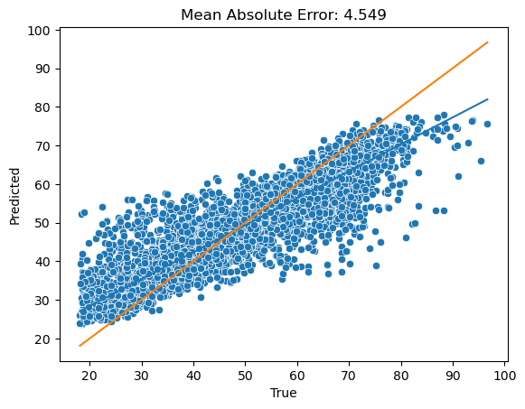
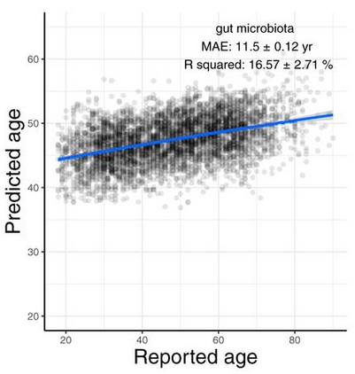
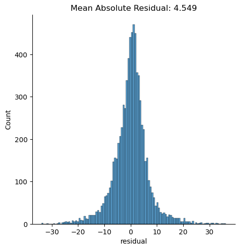

# Attention All Microbes (AAM)
<b>Alpha release</b> : Bugs may be present

Attention-based network for microbial sequencing data. 

# Installation

# Training

Currently only supports  `python cli.py fit-regressor`

# Results

Currently only supports  `python cli.py scatter-plot`

<h2>Significant improvement over random forest</h2>

Compare results from [age regression](https://journals.asm.org/doi/10.1128/msystems.00630-19)

| AAM | Random Forest |
|-----|---------------|
|||
|| |

